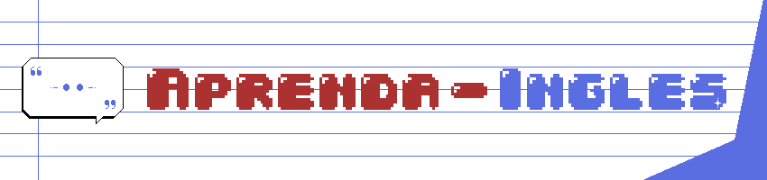

<p align="center">
	
</p>

> Uma plataforma interativa para complementar seus estudos de inglês,com várias frases traduzidas e áudio disponível para prática de pronúncia.

<p align="center">
  <a>
    
  </a>
  <a href="https://opensource.org/licenses/MIT">
    
  </a>
  <a>
    
  </a>
</p>

## 📖 Sobre o Projeto

O **Aprenda Inglês** é um site direto e prático desenvolvido para complementar seus estudos de inglês. Com uma interface limpa e intuitiva, você pode:

- ✅ Traduzir mais de 200 frases do inglês para o português;
- 🔊 Ouvir a pronúncia correta de cada frase;
- 📚 Navegar entre vocabulário básico e expressões úteis.

Acesse: https://aprenda-ingles-delta.vercel.app/

## 🎯 Características

- **Interface Simples**: Design minimalista focado no aprendizado;
- **Áudio Disponível**: Todos os áudios incluídos para prática de pronúncia;
- **Organização por Categorias**: Dividido em Vocabulário e Expressões;
- **Totalmente Gratuito**: Use, modifique e distribua livremente;
- **Fácil Atualização**: Arquivo JSON simples para adicionar novas frases;
- **Responsivo**: Funciona perfeitamente em celulares, tablets e desktops.

## 💡 Por que?

Este projeto nasceu da necessidade de um grupo de amigos, queríamos um espaço comum onde todos pudéssemos estudar o mesmo conteúdo, evoluindo juntos e adaptando as ferramentas conforme aprendíamos o que funcionava melhor.

A ideia era simples: criar uma plataforma colaborativa que crescesse com o tempo, mantendo o que dava certo e incorporando novas funcionalidades que facilitassem o aprendizado. Assim surgiu o Aprenda Inglês um projeto de estudantes para estudantes.

Todo o design foi criado do zero para este projeto. Se você gostar e quiser usar ou se inspirar, fique à vontade! Apenas peço que referencie para seguir incentivando. 🙏

Se este projeto te ajudou nos estudos, considere deixar uma ⭐ no repositório para acompanhar as novas funcionalidades e melhorias!

## 🚀 Como Usar

### Opção 1: Uso Direto
1. Clone ou baixe este repositório
2. Abra o arquivo `index.html` no seu navegador
3. Comece a estudar!

```bash
git clone https://github.com/seu-usuario/aprenda-ingles.git
cd aprenda-ingles
# Abra index.html no navegador
```

### Opção 2: Servidor Local
```bash
# Com Python 3
python -m http.server 8000

# Com Node.js
npx http-server

# Acesse http://localhost:8000
```

## 📁 Estrutura do Projeto

```
aprenda-ingles/
├── index.html                    # Página principal
├── LICENSE                       # Licença MIT
├── README.md                     # Este arquivo
└── src/                          # Código fonte
    ├── assets/                   # Recursos do projeto
    │   ├── audio/                # Áudios das frases
    │   │   ├── expressions/      # Áudios de expressões
    │   │   │   ├── module-01/    # Módulo 1
    │   │   │   ├── module-02/    # Módulo 2
    │   │   │   └── ...           # Outros módulos
    │   │   └── vocabulary/       # Áudios de vocabulário
    │   │       ├── module-01/    # Módulo 1
    │   │       ├── module-02/    # Módulo 2
    │   │       └── ...           # Outros módulos
    │   ├── data/                 # Dados em JSON
    │   │   ├── expressions.json  # Frases de expressões
    │   │   └── vocabulary.json   # Frases de vocabulário
    │   └── images/               # Imagens do projeto
    ├── css/                      # Estilos
    ├── js/                       # Scripts JavaScript
    └── pages/                    # Páginas adicionais
```

## 🔧 Como Adicionar Novas Frases

Edite o arquivo `data.json` seguindo este formato:

```json
[
  {
    "id": 1,
    "title": "Módulo 1",
    "lessons": [
      {
        "id": "1-1",
        "portugues": "Bom dia",
        "english": "Good morning",
        "audio": "/src/assets/audio/vocabulary/module-01/good-morning.mp3",
        "hint": ""
      },
      {
        "id": "1-2",
        "portugues": "Como você está?",
        "english": "How are you?",
        "audio": "/src/assets/audio/vocabulary/module-01/how-are-you.mp3",
        "hint": "Usado para cumprimentar"
      }
    ]
  },
  {
    "id": 2,
    "title": "Módulo 2",
    "lessons": [
      {
        "id": "2-1",
        "portugues": "Muito obrigado",
        "english": "Thank you very much",
        "audio": "/src/assets/audio/vocabulary/module-02/thank-you-very-much.mp3",
        "hint": ""
      }
    ]
  }
]
```

É só adicionar novos objetos no array correspondente!

## 🎵 Adicionando Áudios

1. Adicione os arquivos de áudio na pasta `audio/vocabulario/` ou `audio/expressoes/`
2. Atualize o campo `audioUrl` no `data.json` com o caminho correto
3. Formatos suportados: MP3, WAV, OGG

## 📅 Atualizações

Este projeto recebe atualizações regulares a cada **42 dias**, incluindo:
- Novas frases e expressões;
- Novos áudios;
- Melhorias na interface;
- Correções de bugs.

**Próxima atualização:** 29/03/2026

## 🛠️ Tecnologias Utilizadas

- HTML5
- CSS3 (Design moderno e responsivo)
- JavaScript Vanilla (sem dependências)
- JSON (armazenamento de dados)

## 🤝 Como Contribuir

Sua contribuição é muito importante para este projeto! Você pode ajudar de várias formas:

- ⭐ **Dê uma estrela no repositório** - isso nos motiva a continuar!
- 🔖 **Adicione aos favoritos** - para acompanhar as atualizações;
- 📧 **Entre em contato** - Tem sugestões, dúvidas ou encontrou algum erro? Envie um email para: nilton.f.o.junior@gmail.com
- 🐛 **Reporte problemas** - Abra uma issue descrevendo o que encontrou;
- ✍️ **Sugira melhorias** - Todo feedback é bem-vindo!

## 📝 Licença

Este projeto está sob a licença MIT. Isso significa que você pode:

- Usar comercialmente;
- Modificar o código;
- Distribuir;
- Uso privado.

## 🌟 Agradecimentos

Obrigado por usar este projeto para seus estudos de inglês! Se este recurso te ajudou, considere dar uma ⭐ no repositório.

---

<p align="center">
  "A beleza que vive no ato de compartilhar algo com o outro." - Monja Coen
</p>
